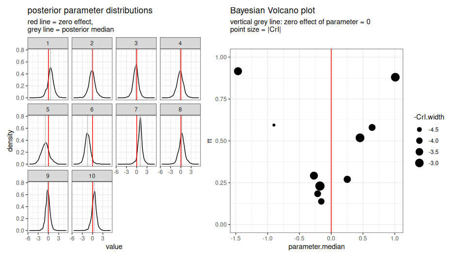

# BayesVolcano

<!-- badges: start -->
<!-- badges: end -->

# Why a Bayesian Volcano Plot Package?
Bayesian models are used to estimate effect sizes (e.g., gene expression changes,
protein abundance differences, drug response effects) while accounting for uncertainty, 
small sample sizes, and complex experimental designs.
However, Bayesian posteriors of models with many parameters are often difficult
to interpret at a glance.

One way to quickly identify important biological changes based on frequentist analysis 
are volcano plots (using fold-changes and p-values).

Bayesian volcano plots bring together the explicit treatment of uncertainty in
Bayesian models and the familiar visualization of volcano plots by:

   1) Calculation and using -values
      on the y-axis as a summary of posterior parameter values lying beyond a threshold.
      With *i* being one entity that was modeled, *param* the estimated parameter and *t*
      the central parameter value corresponding to no effect (default t=0).
      
      %5C,dparam_%7Bi%7D,%5Cint_%7Bparam_%7Bi%7D=t%7D%5E%7B%5Cinfty%7Dp(param_%7Bi%7D)%5C,dparam_%7Bi%7D%5Cright)-1)


   2) Preserving the familiar, intuitive volcano structure.

      The figure below shows the distribution of the posterior samples on the right
      and their translation into a Bayesian volcano plot on the right.

      


   3) Optional displaying credible intervals (CrIs) to visualize uncertainty.
   
We are not the first to think about the concept of Bayesian volcano plots: [Sousa et al. 2020](https://doi.org/10.1016/j.aca.2019.11.006) introduced them as a single
use case (pi-value= 1 - b-value) but to our knowledge we are the first to provide an R-package
for easy calculation of pi-values and visualization. 


## Installation

You can install the development version of BayesVolcano from GitHub with:

``` r
remotes::install_github("KatjaDanielzik/BayesVolcano")
```

and after acceptance to [CRAN](https://cran.r-project.org/) with:

``` r
install.packages("BayesVolcano")
```

## Basic workflow

Input: Posterior of parameters that should be visualized and an annotation
data frame mapping parameter names to labels and optional additional columns.

``` r
library(BayesVolcano)
data("posterior")
data("annotation_df")

result <- prepare_volcano_df(
   posterior = posterior,
   annotation_df = annotation_df,
   null.effect = 0, # central parameter value corresponding to no effect
   CrI.low = 0.025, # lower bound for credible intervals
   CrI.high = 0.975 # upper bound for credible intervals
 )
plot_volcano(result,
             CrI = FALSE, # optional display of credible intervals
             color="group", # optional color coding)
```

plot_volcano returns a ggplot object that can further be customized by the user.


# References
Julie de Sousa, Ondřej Vencálek, Karel Hron, Jan Václavík, David Friedecký, Tomáš Adam,
Bayesian multiple hypotheses testing in compositional analysis of untargeted metabolomic data,
Analytica Chimica Acta, Volume 1097, 2020, Pages 49-61, ISSN 0003-2670,
https://doi.org/10.1016/j.aca.2019.11.006.
(https://www.sciencedirect.com/science/article/pii/S0003267019313492)

Corresponding GitHub Repository: https://github.com/sousaju/BayesVolcano
